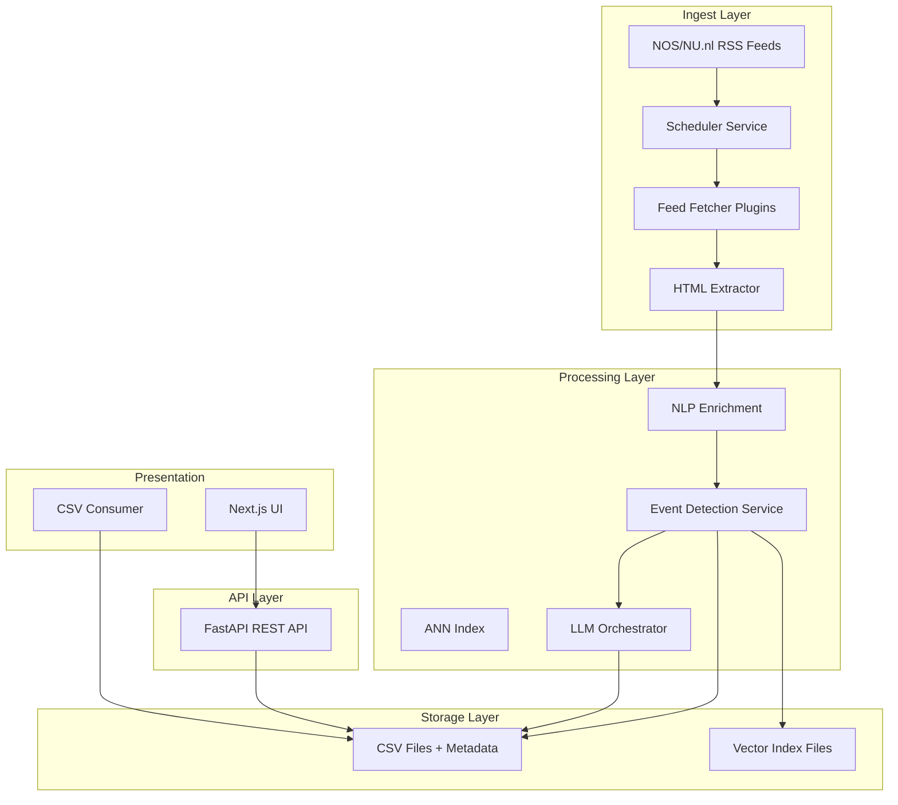

# 360° Nieuwsaggregator PRD

## Status: Draft

## Intro
De 360° Nieuwsaggregator levert één modulair, uitbreidbaar platform dat Nederlandse nieuwsfeeds verwerkt, events detecteert via een hybride algoritme en voor elk event een pluriforme analyse presenteert (tijdlijnen, invalshoeken, drogredeneringen, tegenstrijdige claims). Resultaten zijn beschikbaar via een basis-UI en als CSV-export, zodat onderzoekers en geïnteresseerden de uitkomsten direct kunnen bestuderen. Het fundament moet robuust zijn voor toekomstige uitbreidingen (extra RSS-bronnen, web-scrapingmodules, persistente databanken).

## Goals and Context
- **Projectdoel:** Bouw een schaalbare, goed ontworpen MVP-pijplijn voor nieuwsaggregatie, eventdetectie en LLM-analyse die snel uitbreidbaar is met nieuwe bronnen en opslagopties.
- **Meetbare uitkomsten:** binnen 10 minuten na publicatie een event detecteren en analyseren; CSV-export genereert complete eventinformatie (≥ 95% van events).
- **Succescriteria:** robuuste modulaire architectuur; fouttolerante ingestie; reproduceerbare analysestappen; bruikbare UI.
- **KPI’s:** ingestiefouten <5%; tijd van RSS-publicatie tot CSV-output <15 min; percentage events met volledige LLM-inzichten ≥90%.

## Features and Requirements
- **Functioneel**
  - RSS-ingestie van NOS en NU.nl met plug-in architectuur voor schaalbare uitbreiding.
  - Eventdetectie volgens `context-events.md` (embeddings + TF-IDF + entiteiten + ANN).
  - Mistral LLM-analyse voor tijdlijnen, invalshoeken, drogredeneringen en tegenstrijdige claims.
  - CSV-exports per eventfeed en per eventdetail als tussentijdse “database”.
  - Basis-frontend voor eventfeed (gesorteerd op meest recent artikel) en eventdetailpagina.
- **Niet-functioneel**
  - Modulair, robuust ontwerp met duidelijke lagen (ingest, processing, analytics, presentatie).
  - Codekwaliteit: type hints, Pydantic-validatie, tests, logging, configuration via `.env`.
  - Performantie: eventtoewijzing <1 s; LLM-response <45 s; ingestie <2 min na feedupdate.
  - Schaalbaarheid: horizontaal uitbreidbaar; pipeline component-based.
- **User Experience**
  - Minimalistische UI: eventfeed, detailpagina met kaarten voor timeline/angles/fallacies/contradictions.
  - Responsief basisdesign; duidelijke bronvermelding; CSV-download CTA’s.
  - Statusindicatoren (laatste update, LLM-provider).
- **Integraties**
  - RSS met `feedparser`; HTML-tekstextractie via Trafilatura of Newspaper3k.
  - Embeddings (SentenceTransformers), spaCy NER, TF-IDF (scikit-learn).
  - ANN-index (hnswlib of pgvector); opslag voorlopig CSV-bestanden.
  - Mistral Chat Completions API.
  - Frontend ↔ Backend via REST (FastAPI).
- **Testing**
  - Unit-tests voor ingestie, event scoring, LLM-schema parsing (`pytest`).
  - Integratie smoke test: end-to-end ingestie → CSV export.
  - Linting (ruff/black); type checking (mypy).
  - Monitoring hooks/logging assertions bij pipeline-scripts.

## Epic Story List

### Epic 0: Provisioning & Ops Setup
- **Story 0.1:** Configureer `.env` met RSS-interval, Mistral API key.
- **Story 0.2:** Zet Python 3.12 virtual environment op, installeer dependencies via requirements.txt, init Git.
- **Story 0.3:** Bouw logging- en config-utility (YAML/ENV loader).

### Epic 1: Ingest & Preprocessing Backbone
- **Story 1.1: RSS Feed Module Framework**
  - Ontwerp plug-in interface (`feeds/base.py`) voor feed readers.
  - Implementeer `NosRssReader` en `NuRssReader`.
  - Scheduler (APScheduler/Celery beat) pollt feeds elke 5 min; schrijft ruwe items.
- **Story 1.2: Artikel Extractie & Normalisatie**
  - Download HTML, parse tekst/snippet (Trafilatura).
  - Dedupliceer op URL; schrijf genormaliseerd JSON-record.
  - Log ingest-status; append naar `data/raw_articles.csv` (met file locks).
- **Story 1.3: NLP Verrijking**
  - Tokeniseer, lower, verwijder stopwoorden.
  - Bereken embeddings (MiniLM fallback), TF-IDF vector (joblib persist), spaCy entiteiten.
  - Schrijf verrijkte data naar `data/articles_enriched.csv`.

### Epic 2: Event Detection Service
- **Story 2.1: Vector Index & Candidate Retrieval**
  - Initialiseer hnswlib index (persistable).
  - Query top-k events (k=10) binnen laatste 7 dagen.
- **Story 2.2: Event Scoring & Assignment**
  - Implementeer score `0.6*cos_emb + 0.3*cos_tfidf + 0.1*entity_overlap`.
  - Threshold configureerbaar (default 0.82).
  - Update bestaand event of creëer nieuw event; schrijf naar `data/events.csv` en `data/event_articles.csv`.
- **Story 2.3: Event Maintenance**
  - Update centroids en entiteiten; verzorg reindexing.
  - Opruimen: sluit events ouder dan 14 dagen, archiveer CSV’s.

### Epic 3: LLM Insights Pipeline
- **Story 3.1: Prompt Builder**
  - Genereer eventprompt (subset artikelen) met instructies voor JSON-output.
  - Zorg dat drogredeneringen/contradicties bronvermelding bevatten.
- **Story 3.2: Mistral API Integratie**
  - Implementeer ChatCompletion call (timeout, retries, error logging).
  - Parse JSON, valideer met Pydantic-schema.
  - Sla op in `data/event_insights.csv` met provider & timestamp.
- **Story 3.3: CSV Export Layer**
  - CLI/endpoint dat gecombineerde CSV’s exporteert (events + insights).
  - Documenteer kolommen; lever sample templates.

### Epic 4: Frontend (Basic UI)
- **Story 4.1: Next.js Bootstrap**
  - Setup Next.js + Tailwind; configureer API-URL.
  - Maak basislay-out met header en eventfeed.
- **Story 4.2: Event Feed View**
  - Haal `/api/events` (gesorteerd op nieuwste artikel).
  - Toon cards met titel, bron, laatste update, CTA’s (detail, CSV-download).
- **Story 4.3: Event Detail Page**
  - Render timeline, invalshoeken, drogredeneringen, tegenstrijdigheden.
  - Toon bronlinks, LLM-provider, laatste update.
  - Knop voor CSV-download van dit event.

### Epic 5: Monitoring & QA
- **Story 5.1:** Logging & health endpoints (FastAPI).
- **Story 5.2:** Pytest suite, GitHub Actions CI.
- **Story 5.3:** Smoke test script (ingest sample feed → CSV-export).

### Epic N: Future Enhancements (Out of Scope MVP)
- Webscraping → RSS generator voor sites zonder feeds.
- Persistente database (PostgreSQL + pgvector).
- Integratie met X/alternatieve media.
- Sentiment/stance analysis.
- User accounts, alerts, personalisatie.
- Monitoring dashboards (Grafana/Prometheus).
- Historische backfill & notebooks.

## Technology Stack

| Technology | Version | Description |
| ---------- | ------- | ----------- |
| Python | 3.12 | Hoofdtaal backend & pipelines |
| FastAPI | 0.109+ | REST API & background tasks |
| Uvicorn | 0.25+ | ASGI server |
| venv + pip | stdlib | Virtual environment met requirements.txt |
| feedparser | latest | RSS-ingestie |
| Trafilatura / Newspaper3k | latest | HTML→tekst extractie |
| sentence-transformers | 2.7+ | Embeddings (MiniLM) |
| spaCy (nl_core_news_md) | 3.7+ | NER |
| scikit-learn | 1.4+ | TF-IDF vectorizer |
| hnswlib | 0.8+ | ANN index |
| APScheduler / Celery | latest | Scheduling ingest/pipeline |
| Pydantic | 2.7+ | Data-validatie |
| Requests / HTTPX | latest | API calls |
| pytest | 8+ | Testing |
| mypy / ruff / black | latest | Linting & formatting |
| Next.js | 14+ | Frontend framework |
| TailwindCSS | 3.4+ | Styling |
| Framer Motion | 11+ | Animaties |
| Docker | 24+ | Optioneel packaging/CI |
| CSV/Parquet | n/a | Tijdelijke opslag outputs |

## Project Structure

```
news-aggregator/
├── backend/
│   ├── app/
│   │   ├── __init__.py
│   │   ├── main.py
│   │   ├── config.py
│   │   ├── core/
│   │   │   ├── scheduler.py
│   │   │   ├── logging.py
│   │   │   ├── storage/
│   │   │   │   ├── csv_writer.py
│   │   │   │   └── file_lock.py
│   │   ├── feeds/
│   │   │   ├── base.py
│   │   │   ├── nos.py
│   │   │   └── nunl.py
│   │   ├── pipelines/
│   │   │   ├── ingest.py
│   │   │   ├── enrich.py
│   │   │   ├── event_detection.py
│   │   │   └── insights.py
│   │   ├── services/
│   │   │   ├── embeddings.py
│   │   │   ├── tfidf.py
│   │   │   ├── ner.py
│   │   │   ├── vector_index.py
│   │   │   └── mistral_client.py
│   │   ├── repositories/
│   │   │   ├── article_repo.py
│   │   │   ├── event_repo.py
│   │   │   └── insights_repo.py
│   │   ├── api/
│   │   │   ├── routers/
│   │   │   │   ├── events.py
│   │   │   │   ├── insights.py
│   │   │   │   └── exports.py
│   │   │   └── schemas.py
│   ├── tests/
│   │   ├── unit/
│   │   ├── integration/
│   │   └── fixtures/
│   └── scripts/
│       ├── ingest_job.py
│       ├── refresh_insights.py
│       └── smoke_test.py
├── data/
│   ├── raw_articles.csv
│   ├── articles_enriched.csv
│   ├── events.csv
│   ├── event_articles.csv
│   └── event_insights.csv
├── frontend/
│   ├── app/
│   │   ├── page.tsx
│   │   └── event/[id]/page.tsx
│   ├── components/
│   ├── lib/
│   └── styles/
├── docs/
│   ├── PRD.md
│   └── context-events.md
├── scripts/
│   └── test_rss_feeds.py
├── .env.example
├── pyproject.toml / requirements.txt
├── package.json
└── Makefile / tasks.py
```

> Developer hulpscripts voor ad-hoc tests staan in `/scripts/` (bijv. `test_rss_feeds.py`).

## UI/UX Overview
- **Event Feed Page**
  - Header met zoekveld, laatste update.
  - Eventcards: titel, bronnen, nieuwste artikel timestamp, aantal artikelen, CTA “Bekijk event” en “Download CSV”.
- **Event Detail Page**
  - Hero: titel, timeframe, bronverdeling, downloadknop.
  - Secties: tijdlijn, invalshoeken, drogredeneringen, tegenstrijdige claims, artikellijst.
  - Bronlinks en LLM-provider zichtbaar.
- **CSV Download**
  - Buttons op feed/detail; downloads via REST endpoint (`/api/exports/{event_id}` en `/api/exports/events`).
- **Status Banner**
  - Toont LLM-provider, laatst geüpdatet, eventuele fouten.
- **Styling**
  - Minimalistisch, modern; Tailwind tokens; lichte/donkere varianten optioneel.


> Consent/cookie handling: bronnen met privacy gates vereisen configureerbare login/consent flows (zie Story 1.2.1).

## High-Level Architecture



## Unknowns, Assumptions, Risks
- **Unknowns:** toekomstige scraping-bronnen; exacte LLM-kosten; welke database later volgt (aanname: PostgreSQL + pgvector).
- **Assumpties:** Mistral API beschikbaar; RSS-feeds stabiel; embeddings/NER draaien CPU-only.
- **Risico’s:** LLM-fouten; concurrency bij CSV’s; vectorindex-corruptie; feed throttling.
  - *Mitigaties:* schema-validatie, file locks, retries/backoff, monitoring & alerting.

## POST MVP / PRD Features
- Webscrapingmodule → RSS generator voor sites zonder feeds.
- Persistente database (PostgreSQL + pgvector).
- Extra nieuwsbronnen (alternatieve media, X).
- Sentiment/stance analyse.
- User accounts, alerts, personalisatie.
- Monitoring dashboards (Grafana/Prometheus).
- Historische backfill en Jupyter notebooks.

## Change Log
| Change | Story ID | Description |
| ------ | -------- | ----------- |
| Initial draft | N/A | Eerste versie PRD voor MVP |
