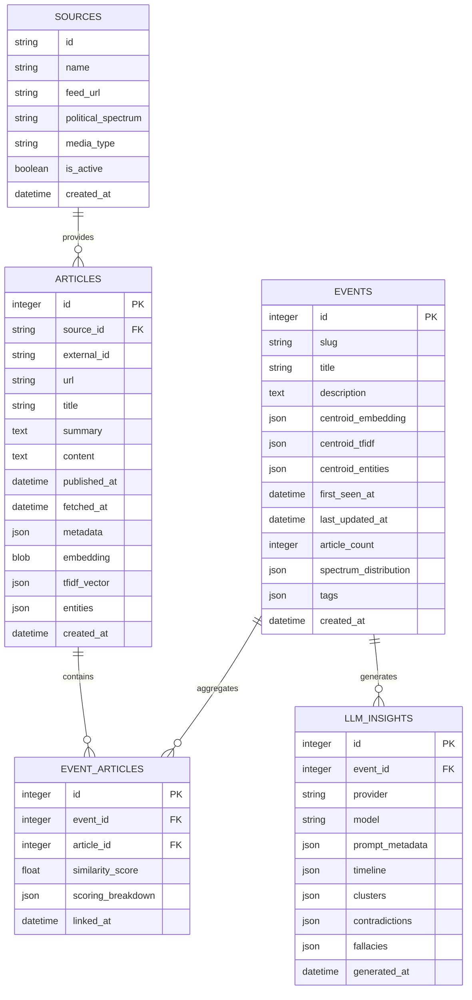
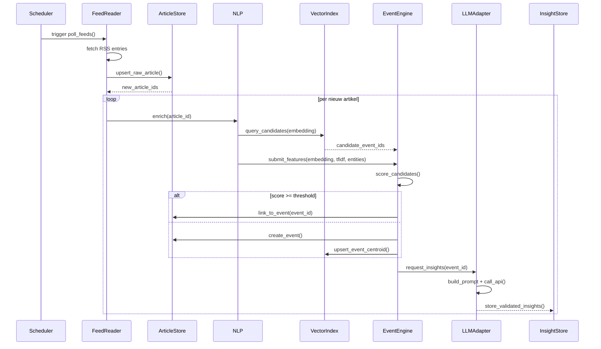

# Architecture for 360° Nieuwsaggregator

Status: Draft

## Technical Summary
De MVP wordt een modulair Python-platform dat nieuwsartikelen uit Nederlandse bronnen binnenhaalt, verrijkt en groepeert tot events, waarna een LLM pluriforme perspectieven afleidt. De architectuur splitst ingestie, verwerking, eventdetectie, LLM-analyse en presentatie in duidelijke lagen om onderhoudbaarheid en uitbreidbaarheid te waarborgen.

We kiezen voor een service-georiënteerde monoliet: één codebase met gescheiden modules en asynchrone pipelines die lokaal draaien maar schaalbaar zijn naar aparte services. Persistentie gebeurt in SQLite (met WAL) voor robuustheid en makkelijke migratie naar PostgreSQL; vectorindexering blijft in hnswlib. FastAPI biedt REST-endpoints voor de frontend en CSV-exports, terwijl Next.js/Tailwind de UI levert.

## Technology Table

| Technology | Version | Description |
| ---------- | ------- | ----------- |
| Python | 3.12 | Primaire taal voor backend, pipelines en tooling |
| venv + pip | stdlib | Virtual environment met requirements.txt dependency management |
| FastAPI | 0.111 | REST API layer met async support |
| Uvicorn | 0.30 | ASGI-server voor FastAPI |
| APScheduler | 3.10 | In-process scheduler voor periodieke ingestietaken |
| SQLAlchemy | 2.0 | ORM + querylaag boven SQLite/PostgreSQL |
| SQLite | 3.45 (WAL) | Embedded database voor MVP, eenvoudig te migreren |
| Alembic | 1.13 | Database migrations vanaf MVP |
| hnswlib | 0.7 | Persistente ANN-vectorindex voor eventkandidaten |
| sentence-transformers | 2.7 | Embeddings (`paraphrase-multilingual-MiniLM-L12-v2`) |
| spaCy | 3.7 (`nl_core_news_lg`) | NER en NLP preprocessing |
| scikit-learn | 1.5 | TF-IDF vectorisatie en normalisatie |
| Trafilatura | 1.7 | HTML-tekstextractie |
| httpx | 0.27 | Async HTTP-client voor RSS, scraping en LLM-calls |
| Mistral API | `mistral-large-latest` wrapper | LLM voor analyseresultaten (verwisselbare provider) |
| Pydantic | 2.7 | Datavalidatie voor API en pipeline-schema's |
| Next.js | 14 | Frontend framework (App Router) |
| React | 18 | UI rendering |
| Tailwind CSS | 3.4 | Styling en utility-first componenten |
| Playwright | 1.45 | E2E-tests voor frontend |
| pytest | 8.3 | Backend testframework |
| ruff | 0.5 | Linter (PEP 8 + best practices) |
| black | 24.4 | Code formatter voor Python |
| mypy | 1.10 | Type checking |

## High-Level Overview

Architectuurstijl: **Service-georiënteerde modulair monoliet**. Eén repository bevat discrete lagen voor ingestie, processing, analytics en presentatie. Componenten communiceren via interne service-interfaces en delen een centrale database plus bestandsopslag. Deze keuze biedt lokale eenvoud en maakt toekomstige opsplitsing in microservices mogelijk (door duidelijke boundaries, adapters en config via `.env`).

```mermaid
flowchart LR
    subgraph Sources
        RSS[NOS & NU.nl RSS]
        Alt[Alternatieve media (placeholder)]
        XFeed[X/Twitter Streams (POST-MVP)]
    end

    subgraph Backend Monolith
        Scheduler[APScheduler Jobs]
        IngestService[Feed + Article Ingest Service]
        NLPService[NLP Enrichment Service]
        EventDetector[Event Detection Engine]
        LLMOrchestrator[LLM Orchestrator]
        RepositoryLayer[SQLAlchemy Repositories]
        CSVExporter[CSV Exporter]
        FastAPI[FastAPI REST API]
    end

    subgraph Storage
        DB[(SQLite DB)]
        VectorStore[(hnswlib Index)]
        BlobStore[(Local filesystem: article cache, CSV)]
    end

    subgraph Frontend
        NextApp[Next.js UI]
        Analysts[Researchers / CSV Consumers]
    end

    RSS --> Scheduler --> IngestService --> NLPService --> EventDetector
    EventDetector --> RepositoryLayer --> DB
    EventDetector --> VectorStore
    LLMOrchestrator --> RepositoryLayer
    RepositoryLayer --> CSVExporter --> BlobStore
    FastAPI --> RepositoryLayer
    FastAPI --> CSVExporter
    NextApp --> FastAPI
    Analysts --> BlobStore
```

### Component View

```mermaid
flowchart TB
    subgraph Ingest Layer
        FeedPlugins[Feed Reader Plugins]
        ArticleFetcher[HTML Fetcher]
        Parser[Trafilatura Parser]
    end

    subgraph Processing Layer
        Preprocessor[Text Normalizer]
        Embedder[Embedding Service]
        TFIDFService[TF-IDF Vectorizer]
        NERService[spaCy NER]
    end

    subgraph Event Layer
        CandidateRetriever[ANN Candidate Retriever]
        Scorer[Hybrid Scoring]
        EventManager[Event Updater]
    end

    subgraph Analytics
        PromptBuilder[Prompt Builder]
        LLMClient[LLM Client Adapter]
        InsightValidator[Pydantic Validator]
    end

    subgraph API Layer
        EventRouter[/events router]
        InsightRouter[/insights router]
        ExportRouter[/exports router]
    end

    FeedPlugins --> ArticleFetcher --> Parser --> Preprocessor
    Preprocessor --> Embedder
    Preprocessor --> TFIDFService
    Preprocessor --> NERService
    Embedder --> CandidateRetriever
    TFIDFService --> CandidateRetriever
    NERService --> Scorer
CandidateRetriever --> Scorer --> EventManager
EventManager --> PromptBuilder --> LLMClient --> InsightValidator --> EventManager
EventManager --> EventRouter
EventManager --> InsightRouter
EventManager --> ExportRouter
```

**Key Components (Event Layer focus)**

- `backend/app/services/vector_index.py` — `VectorIndexService` bewaart een hnswlib-index onder `data/vector_index.bin`, valideert metadata (`vector_index.meta.json`) en biedt recency-aware `query_candidates`-calls (top-k binnen 7 dagen, configureerbaar via `EVENT_CANDIDATE_*`).
- `backend/app/repositories/event_repo.py` — levert `EventCentroidSnapshot` records richting de indexservice en houdt logging bij wanneer centroids ontbreken/malformed zijn.
- `backend/app/db/models.py` — bevat nu `Event`- en `EventArticle`-tabellen met velden voor centroids, entiteiten, artikelcount en `archived_at` voor lifecyclebeheer.

## Architectural Diagrams, Data Models, Schemas

### Data Model Overview



### Core Table Definitions (SQLite syntax)

```sql
CREATE TABLE sources (
    id TEXT PRIMARY KEY,
    name TEXT NOT NULL,
    feed_url TEXT,
    political_spectrum TEXT,
    media_type TEXT CHECK(media_type IN ('rss', 'web', 'social')),
    is_active INTEGER DEFAULT 1,
    created_at DATETIME DEFAULT CURRENT_TIMESTAMP
);

CREATE TABLE articles (
    id INTEGER PRIMARY KEY AUTOINCREMENT,
    source_id TEXT NOT NULL REFERENCES sources(id),
    external_id TEXT,
    url TEXT NOT NULL UNIQUE,
    title TEXT,
    summary TEXT,
    content TEXT,
    normalized_text TEXT,
    normalized_tokens JSON,
    published_at DATETIME,
    fetched_at DATETIME,
    metadata JSON,
    embedding BLOB,
    tfidf_vector JSON,
    entities JSON,
    enriched_at DATETIME,
    created_at DATETIME DEFAULT CURRENT_TIMESTAMP
);

CREATE TABLE events (
    id INTEGER PRIMARY KEY AUTOINCREMENT,
    slug TEXT UNIQUE,
    title TEXT,
    description TEXT,
    centroid_embedding JSON,
    centroid_tfidf JSON,
    centroid_entities JSON,
    first_seen_at DATETIME,
    last_updated_at DATETIME,
    article_count INTEGER DEFAULT 0,
    spectrum_distribution JSON,
    tags JSON,
    created_at DATETIME DEFAULT CURRENT_TIMESTAMP
);

CREATE TABLE event_articles (
    id INTEGER PRIMARY KEY AUTOINCREMENT,
    event_id INTEGER NOT NULL REFERENCES events(id) ON DELETE CASCADE,
    article_id INTEGER NOT NULL REFERENCES articles(id) ON DELETE CASCADE,
    similarity_score REAL,
    scoring_breakdown JSON,
    linked_at DATETIME DEFAULT CURRENT_TIMESTAMP,
    UNIQUE(event_id, article_id)
);

CREATE TABLE llm_insights (
    id INTEGER PRIMARY KEY AUTOINCREMENT,
    event_id INTEGER NOT NULL REFERENCES events(id) ON DELETE CASCADE,
    provider TEXT NOT NULL,
    model TEXT NOT NULL,
    prompt_metadata JSON,
    timeline JSON,
    clusters JSON,
    contradictions JSON,
    fallacies JSON,
    generated_at DATETIME DEFAULT CURRENT_TIMESTAMP
);
```

### Sequence Diagram – Event Pipeline



## Project Structure

```
.
├── backend/
│   ├── app/
│   │   ├── __init__.py
│   │   ├── core/
│   │   │   ├── config.py          # Settings, .env loader, feature flags
│   │   │   ├── logging.py         # Structured logging setup
│   │   │   └── scheduler.py       # APScheduler config & job registration
│   │   ├── feeds/
│   │   │   ├── base.py            # Abstract feed reader interface
│   │   │   ├── nos.py             # NOS implementation
│   │   │   └── nunl.py            # NU.nl implementation
│   │   ├── ingestion/
│   │   │   ├── fetcher.py         # HTTP fetching & consent-aware pipeline
│   │   │   ├── parser.py          # Trafilatura wrapper
│   │   │   └── profiles.py        # Source profile definitions
│   │   ├── nlp/
│   │   │   ├── preprocess.py      # Tokenization, stopwords, normalization
│   │   │   ├── embeddings.py      # Sentence-transformers adapter
│   │   │   ├── tfidf.py           # TF-IDF pipeline utilities
│   │   │   └── ner.py             # spaCy wrapper
│   │   ├── events/
│   │   │   ├── scoring.py         # Hybrid scoring logic
│   │   │   ├── detector.py        # Assignment engine
│   │   │   └── maintenance.py     # Centroid updates, pruning
│   │   ├── llm/
│   │   │   ├── prompt_builder.py  # Prompt templates & chunking
│   │   │   ├── client.py          # Provider-agnostic adapter (Mistral default)
│   │   │   └── schemas.py         # Pydantic models for insights
│   │   ├── repositories/
│   │   │   ├── base.py            # Generic CRUD helpers
│   │   │   ├── article_repo.py
│   │   │   ├── event_repo.py
│   │   │   └── insight_repo.py
│   │   ├── services/
│   │   │   ├── ingest_service.py  # Orchestrates feed ingest flow
│   │   │   ├── enrich_service.py  # Handles NLP enrichment pipeline
│   │   │   ├── vector_index.py    # Persistente hnswlib-index met recency-filter
│   │   │   ├── event_service.py   # Event detection orchestration
│   │   │   └── export_service.py  # CSV export assembly
│   │   ├── api/
│   │   │   ├── dependencies.py
│   │   │   ├── routers/
│   │   │   │   ├── events.py
│   │   │   │   ├── insights.py
│   │   │   │   └── exports.py
│   │   │   └── main.py            # FastAPI app entrypoint
│   │   └── db/
│   │       ├── models.py          # SQLAlchemy models
│   │       ├── session.py         # Session/engine management
│   │       └── migrations/
│   ├── scripts/
│   │   ├── run_ingest_once.py
│   │   ├── rebuild_index.py
│   │   └── smoke_test.py
│   └── tests/
│       ├── unit/
│       ├── integration/
│       ├── e2e/
│       └── fixtures/
├── frontend/
│   ├── app/
│   │   ├── layout.tsx
│   │   ├── page.tsx                # Event feed overview
│   │   └── event/[id]/page.tsx     # Event detail page
│   ├── components/
│   │   ├── EventCard.tsx
│   │   ├── ClusterGrid.tsx
│   │   ├── Timeline.tsx
│   │   └── SpectrumBadge.tsx
│   ├── lib/
│   │   └── api.ts                  # Backend client utilities
│   ├── styles/
│   └── tests/
│       └── event-flow.spec.ts      # Playwright scenarios
├── docs/
│   ├── PRD.md
│   ├── context-events.md
│   └── architecture.md
├── scripts/                        # Losse hulpscripts (bv. RSS probes)
│   ├── test_rss_feeds.py
│   └── refresh_cookies.py
├── data/                           # Local data/cache folder
│   ├── cookies/                    # Persisted consent/session cookies per source
│   ├── vector_index.bin
│   └── exports/
├── source_profiles.yaml            # Source-specific fetch/consent configuration
├── infra/
│   ├── docker-compose.yml          # Local stack (SQLite, backend, frontend)
│   ├── dev.Dockerfile
│   └── scripts/
│       └── migrate.sh
├── .env.example
├── pyproject.toml
├── package.json
├── Makefile
└── README.md
```

> Algemene hulpscripts (zoals `scripts/test_rss_feeds.py`) bieden snelle checks zonder volledige pipeline.


### Source Profiles & Consent Handling

To support sources with different access requirements, the ingestion layer relies on `source_profiles.yaml`. Each profile defines:

- `feed_url`: primary RSS/JSON endpoint.
- `fetch_strategy`: `simple`, `consent_cookie`, `dynamic_render`, etc.
- `consent_endpoint` + params for providers met privacy gates (e.g., DPG Media).
- `user_agent`, `headers`, `parser` preference (trafilatura, readability/naive fallback).
- `probe_url` (optioneel): vaste URL voor cookie-refresh; anders wordt de feed gebruikt.
- `requires_js`: toggle voor headless-browser fallback.
- `cookie_ttl_minutes`: controls when stored cookies expire.

The fetcher executes a pipeline per profile:

1. Attempt direct fetch (with configured UA/cookies).
2. If redirected to consent, follow profile instructions to obtain consent cookies, persist them under `data/cookies/<source>.json`, then retry.
3. Apply parser fallback as configured.
4. Optionally invoke dynamic renderer hook for JS-only pages.
5. Emit structured log with outcome (success, consent failure, parser failure).

When adding a new source:

1. Append profile entry to `source_profiles.yaml`.
2. Place consent/cookie instructions (if any).
3. Run `scripts/refresh_cookies.py --source <id>` to refresh cookies (uses feed entries when `probe_url` ontbreekt).
4. Verifieer via `scripts/test_rss_feeds.py --reader <id> --show-content`.

The architecture remains provider-agnostic: updating profile entries avoids touching ingestion code.

> Manual override: als een consent flow faalt, kopieer de vereiste cookies via de browser en plaats ze in `data/cookies/<source>.json` (zelfde structuur als automatisch opgeslagen payload).

### Event Maintenance Lifecycle

Een aparte onderhoudsservice bewaakt de kwaliteit van events en de vectorindex:

- `backend/app/events/maintenance.py` bevat de `EventMaintenanceService` die alle actieve events ophaalt, centroiden opnieuw uitrekent op basis van gekoppelde artikelen en entiteiten merge't.
- Events zonder nieuwe artikelen binnen `EVENT_RETENTION_DAYS` worden gemarkeerd met `archived_at` en direct uit de hnswlib-index verwijderd zodat ze geen kandidaten meer vormen.
- De service vergelijkt de huidige database-snapshot met de index en voert een `VectorIndexService.rebuild()` uit zodra drift wordt gedetecteerd (extra of ontbrekende labels). Dit gedrag is aan/uit te zetten via `EVENT_INDEX_REBUILD_ON_DRIFT`.
- APScheduler registreert `event_maintenance` (standaard iedere 24 uur, configureerbaar via `EVENT_MAINTENANCE_INTERVAL_HOURS`) als tweede achtergrondtaak naast `poll_rss_feeds`.

Resultaat: centroiden blijven representatief, oude events verdwijnen automatisch uit de zoekruimte en index-corruptie wordt hersteld zonder handmatige interventie.

## Testing Requirements and Framework

- **Unit Testing (pytest)**
  - `backend/tests/unit` voor pure functies (scoring, prompt generation, parsing).
  - Vereist minimale coverage van 80% voor kritieke modules (`events`, `llm`).
- **Integration Tests**
  - `backend/tests/integration` met tijdelijke SQLite database in geheugen + fixture data.
  - Scenario's: ingestie van feed tot event creatie; LLM respons parsing via gemockte provider.
- **End-to-End Tests**
  - `backend/tests/e2e` start FastAPI met TestClient, controleert CSV-download en uitgebreide API flow.
  - `frontend/tests` bevat Playwright-scripts voor UI-regressie.
- **Static Analysis**
  - `ruff` linting via pre-commit hooks.
  - `black` voor formatting (line length 100).
  - `mypy` strict optional check op backend modules (excl. routers bij eerste iteratie).
- **CI Checks**
  - `make ci` bundelt lint, type-check, tests en build.

## Patterns and Standards (Opinionated & Specific)

- **Architectural Patterns**
  - Modulair monoliet met duidelijke service-interfaces en dependency inversion tussenniveaus.
  - Repository Pattern voor database interactie; services orchestreren businesslogica.
  - Strategy Pattern voor pluggable feed readers en LLM-clients.
  - Event Detection Engine gebruikt Template Method (score → decide → persist) voor consistentie.
- **API Design Standards**
  - RESTful JSON endpoints (`/api/v1/...`).
  - Naming: meervoudige resources (`/events`, `/insights`), detail via ID (`/events/{event_id}`).
  - Responses bevatten `data`, `meta`, `links` volgens JSON:API-lite.
  - Authentication: niet vereist MVP; hook voorzien voor API key of OAuth.
  - Error responses: HTTP status + `{ "error": { "code", "message", "details" } }`.
- **Coding Standards**
  - Backend: PEP 8 + type hints verplicht; docstrings via Google style op publieke functies.
  - Frontend: TypeScript strict mode; ESLint (Next.js preset) + Prettier.
  - Bestandsnamen: snake_case voor Python modules, PascalCase voor React componenten.
  - Tests: `test_*.py` naast modules (unit) of in gespiegelde map (integration/e2e).
- **Error Handling Strategy**
  - Structured logging (`structlog` via FastAPI logging config) met correlation IDs per job.
  - Service-methoden gooien domein-specifieke exceptions (`ArticleFetchError`, `LLMTimeoutError`), vertaald naar API 5xx/4xx.
  - Retry/backoff decorator (tenacity) voor externe calls (feeds, LLM).
  - Dead-letter logmap voor mislukte jobs (`data/errors/`).

## Initial Project Setup (Manual Steps)

- **Story 0 – Setup Taken**
  1. Clone repo & installeer Python 3.12/Node 20.
  2. `make setup` (creeert .venv, installeert requirements.txt + npm dependencies).
  3. Kopieer `.env.example` → `.env`; vul `MISTRAL_API_KEY`, scheduler interval, embedding modelnaam en de nieuwe vectorindex-parameters (`VECTOR_INDEX_*`, `EVENT_CANDIDATE_*`).
  4. Controleer dat het pad in `VECTOR_INDEX_PATH` schrijfbaar is (default `./data/vector_index.bin`) en maak zo nodig `data/` + `data/models/` aan.
  5. Initialiseert database: `source .venv/bin/activate && alembic upgrade head` (maakt SQLite + schema).
  6. Download spaCy model: `source .venv/bin/activate && python -m spacy download nl_core_news_lg` (wanneer NER geimplementeerd).
  7. Prime TF-IDF model: `source .venv/bin/activate && python backend/scripts/build_tfidf.py --bootstrap` (wanneer ML geimplementeerd).
  8. Start dev stack: `make dev` (backend + frontend) of afzonderlijk via `make backend-dev`.
  9. Gebruik `python scripts/test_rss_feeds.py` voor een snelle RSS-check zonder persisteren.

## Infrastructure and Deployment

- **Execution Environment**
  - MVP draait lokaal via Docker Compose (FastAPI, Next.js, volumes voor data, SQLite file).
  - Optionele dev container (VSCode Dev Containers) voor consistente toolchain.
- **Persistence**
  - SQLite database met WAL-mode op gedeelde volume `./data/db.sqlite`.
  - hnswlib indexbestand `./data/vector_index.bin` met checksum controle.
  - CSV-exports opgeslagen in `./data/exports/` met timestamp in bestandsnaam.
- **CI/CD**
  - GitHub Actions workflow `ci.yml` draait lint, tests en build.
  - Artefact: gecontaineriseerde backend/frontend images (ghcr.io).
  - Deploy-strategie (post-MVP): promote naar container platform (Fly.io/Render) met Postgres + pgvector.
- **Observability**
  - Logging naar stdout + roterende file `logs/app.log`.
  - Prometheus endpoints (FastAPI dependency) voor basis metrics (requests, job timings) – optioneel Post-MVP.

## Change Log

| Date | Version | Description |
| ---- | ------- | ----------- |
| 2025-02-14 | 0.1 | Eerste architectuurdocument voor MVP |
| 2025-10-01 | 0.2 | Story 2.1 – VectorIndexService + EventRepository snapshots toegevoegd; .env uitgebreid met vectorindexparameters |
| 2025-10-02 | 0.3 | Story 2.2 – Hybrid scoring module, EventService orchestration en ingest-integratie voor artikel→event toewijzing |
| 2025-10-02 | 0.4 | Story 2.3 – EventMaintenanceService, archiveringsflow en automatische indexrebuild + nieuwe scheduler/retentie settings |
